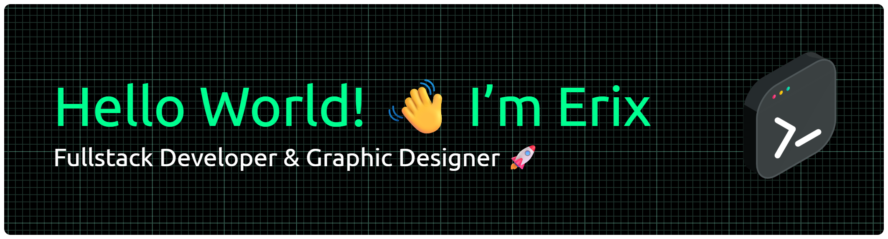

💻 **[Junior Programmer | Web Dev Enthusiast]**

✨ Exploring PHP, JavaScript & Laravel to build awesome stuff

##### 💫Skills

##### 📲 Connect Me
  

##### 📊 GitHub Stats:

 

 

<!-- Proudly created with GPRM ( https://gprm.itsvg.in ) -->
<!--
**erixpraditya/erixpraditya** is a ✨ _special_ ✨ repository because its `README.md` (this file) appears on your GitHub profile.

Here are some ideas to get you started:

- 🔭 I’m currently working on ...
- 🌱 I’m currently learning [**Laravel**] Framework
- 👯 I’m looking to collaborate on ...
- 🤔 I’m looking for help with ...
- 💬 Ask me about ...
- 📫 How to reach me: ...
- 😄 Pronouns: ...
- ⚡ Fun fact: ...
-->
